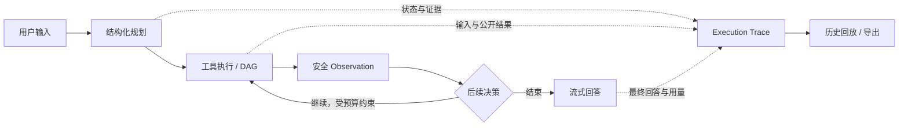

# InsightAgent

**可视化、可解释、工具驱动的 AI Agent 工作台。**

InsightAgent 把对话、知识检索、工具执行和结果回放放在同一个工作台中。用户可以查看一项任务如何规划、调用了哪些工具、检索到哪些来源，以及回答如何流式生成；任务结束后，执行轨迹与用量仍可查询、导出和复核。

[快速开始](#快速开始) · [使用示例](#使用示例) · [架构](docs/architecture.md) · [配置](docs/configuration.md) · [文档](docs/README.md) · [贡献](CONTRIBUTING.md)

## 核心能力

| 能力 | 当前实现 |
| --- | --- |
| Execution Trace | 时间线与流程图，展示工具输入、公开结果、依赖、并发分组及失败原因；实时流、历史回放和导出共用 TraceStep。 |
| 工具驱动 Agent | 结构化规划、实际工具执行、Observation 反馈与有界多轮决策；内建知识检索和安全表达式计算，支持配置 HTTP JSON 工具。 |
| Memory / RAG | 会话级语义记忆与用户隔离知识库；UTF-8 文本文件预览、后台导入、文档版本、来源引用、检索调试及共享库权限。 |
| 流式交互 | SSE 输出回答和执行状态，heartbeat、增量 Trace 同步、断线接管、取消与超时处理。 |
| 任务恢复 | 完整任务分支重跑；实验性内建顺序计划 checkpoint，可复用成功前缀，原任务保留。 |
| 治理与观测 | JWT / refresh 会话、用户设置与 Key 加密、RBAC-lite、审计、任务中心、用量统计及低敏请求日志。 |
| 工程验证 | OpenAPI 指纹、主题化回归测试、前后端发布门禁、浏览器 e2e、隔离 PostgreSQL/Chroma 与候选镜像协议验证。 |

“可解释”指可观察的执行依据。Trace 不暴露模型内部思维过程，也不能单独证明答案正确。工具执行以实际 action 与状态为准，模型对执行行为的自然语言描述仍需核对。

## 适用场景

- 检索指定知识库并回答问题，复核引用来源和文档版本。
- 把检索事实交给计算或已配置的 HTTP 工具，查看实际输入与公开结果。
- 调试模型规划、取消或恢复任务，对照历史 Trace、导出与用量定位问题。

当前工作台面向有界任务执行和复核；不提供通用操作系统控制、可视化流程编辑或自动长期记忆召回。

## 工作流



首轮规划失败时采用既有规则回退；后续决策失败按任务错误处理。轮次、工具数和证据大小均有上限。完整执行边界见[Agent 核心契约](docs/architecture.md#agent-上下文与反馈)。

## 架构与技术栈

- **前端**：Next.js 16、React 19、TypeScript、Ant Design、Zustand、TanStack Query / Virtual、React Flow。
- **后端**：Python 3.14、FastAPI、Uvicorn、Pydantic，OpenAI-compatible 模型适配与模块化 tool runtime。
- **持久化**：PostgreSQL 16 保存业务历史与执行账本；Chroma 保存会话 Memory 和知识库向量。
- **验证**：unittest / Node tests、Playwright、GitHub Actions、Docker Compose。

```text
InsightAgent/
├── backend/       FastAPI、执行器、持久化、Provider 与回归测试
├── frontend/      工作台、Trace、治理页面与浏览器测试
├── scripts/       发布门禁、验收、镜像与备份演练工具
├── docs/          架构、契约、操作指南与验收证据
└── data/          本机历史资料与只读原始计划，不是运行时主数据库
```

模块职责、数据边界及设计取舍见[架构说明](docs/architecture.md)。

## 快速开始

本地基线：Python 3.14、Node.js 24+、Docker Desktop / Docker Compose，以及可用的 PostgreSQL 和 Chroma。以下命令在项目根目录执行；首次安装需联网。

```bash
python3.14 -m venv backend/.venv
backend/.venv/bin/python -m pip install -r backend/requirements.txt
npm --prefix frontend ci
cp backend/.env.example backend/.env
```

**已有运行实例时先检查端口与健康状态，不要重复启动或重建存储。** 首次使用、没有既有数据容器时启动依赖：

```bash
docker compose -f compose.full.yml up -d postgres chroma
```

分别在两个终端启动应用：

```bash
backend/.venv/bin/python -m uvicorn app.main:app --app-dir backend --host 127.0.0.1 --port 8000
```

```bash
npm --prefix frontend run dev
```

打开 [工作台](http://127.0.0.1:3001/)，注册并登录；首个注册账号具有管理员角色。默认 mock 模式可验证离线演示路径。使用真实模型时，在“模型设置”中填写 remote、模型、兼容 API 地址和 Key，校验后保存。Key 仅发送给后端，不进入前端构建；连接校验不等于真实任务验收。

[健康检查](http://127.0.0.1:8000/health) · [API 文档](http://127.0.0.1:8000/docs) · [OpenAPI](http://127.0.0.1:8000/openapi.json)

开发 Compose 使用开发凭据、浮动基础镜像和本地端口；单机试点使用独立的 [生产配方与预检](docs/pilot-deployment-preflight.md)。`start_insightagent.command` 是本机便利脚本，会释放应用端口并执行依赖 `up`；已有服务或旧 Chroma 数据时优先使用手动命令，先读[运行手册](docs/development-runbook.md)和[备份说明](docs/pilot-deployment-preflight.md#开发栈备份恢复)。

## 使用示例

1. 在 mock 模式输入 `计算 17 * 19`，查看回答和 Calculator 的实际 action；mock 是明确演示模式。
2. 在模型设置保存 remote 配置。导入 UTF-8 TXT/Markdown 到指定知识库，再询问资料中的事实或派生计算；通过 Trace 核对 source / document_version 与实际工具执行。
3. 打开任务详情查看时间线、流程图和 JSON / Markdown 导出。失败后可编辑输入创建独立分支；实验性“从步骤继续”仅复用内建顺序计划的成功前缀。

任务 completed 表示执行和保存结束；回答正确性、引用质量及工具声明还需结合证据复核。计费展示是配置单价估算，不是供应商账单。

## 数据与执行边界

PostgreSQL 是消息、任务、Trace 和用量的主存储。Chroma 分别保存会话级 Memory 和用户隔离知识库，shared-* 由管理员写入；当前对话上下文读取有界 PostgreSQL 历史，没有自动长期 Memory 召回。默认 embedding 在后端 Chroma Python 客户端计算，试点镜像构建期准备缓存。

REST、SSE、Trace delta、历史回放与 JSON v1.0 / Markdown 导出读取同一执行记录；成功状态与回答原子提交。完整字段、事件、取消/超时和恢复规则见[运行时契约](docs/runtime-contracts.md)，数据分工见[架构](docs/architecture.md)。

## 项目状态

本地实现与工程收尾完成，现阶段按可复现问题维护。后端、前端、浏览器、隔离存储、真实 GLM 与候选镜像各有独立验证范围，详见[验证基线](docs/acceptance.md#验证基线)与[真实模型记录](docs/acceptance.md#真实模型记录)。真实业务资料、目标用户签收和部署环境尚未验收，外部试点/生产就绪未获验证。

写入工具并行、HTTP/DAG checkpoint 延期；PDF/Office/OCR 导入、内建网页搜索和图编辑器不在当前实现范围。开发与测试命令见[贡献指南](CONTRIBUTING.md)和[运行手册](docs/development-runbook.md)，业务任务复核见[验收指南](docs/acceptance.md)。

## 文档与维护

从[文档导航](docs/README.md)按使用、开发、运行或验收查找资料。接口与实现入口分别见[后端 README](backend/README.md)、[前端 README](frontend/README.md)；契约变更记录见[API 变更记录](docs/api-changelog.md)。

README 提供项目与模块入口，专题文档维护稳定行为，验证基线记录当前状态和证据。贡献流程见 [CONTRIBUTING.md](CONTRIBUTING.md)，安全问题见 [SECURITY.md](SECURITY.md)。项目采用 [MIT License](LICENSE)。
