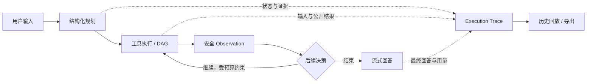

# InsightAgent

**可视化、可解释、工具驱动的 AI Agent 工作台。**

InsightAgent 把对话、知识检索、工具执行和结果回放放在同一个工作台中。用户可以查看一项任务如何规划、调用了哪些工具、检索到哪些来源，以及回答如何流式生成；任务结束后，执行轨迹与用量仍可查询、导出和复核。

[快速开始](#快速开始) · [架构](docs/architecture.md) · [配置](docs/configuration.md) · [文档](docs/README.md) · [贡献](CONTRIBUTING.md)

## 核心能力

| 能力 | 当前实现 |
| --- | --- |
| Execution Trace | 时间线与流程图，展示工具输入、公开结果、依赖、并发分组及失败原因；实时流、历史回放和导出共用 TraceStep。 |
| 工具驱动 Agent | 结构化规划、实际工具执行、Observation 反馈与有界多轮决策；内建知识检索和安全表达式计算，支持配置 HTTP JSON 工具。 |
| Memory / RAG | 会话级语义记忆与用户隔离知识库；UTF-8 文本文件预览、后台导入、文档版本、来源引用、检索调试及共享库权限。 |
| 流式交互 | SSE 输出回答和执行状态，heartbeat、增量 Trace 同步、断线接管、取消与超时处理。 |
| 任务恢复 | 完整任务分支重跑；实验性内建顺序计划 checkpoint，可复用成功前缀，原任务保留。 |
| 治理与观测 | JWT / refresh 会话、用户设置与 Key 加密、RBAC-lite、审计、任务中心、用量统计及低敏请求日志。 |
| 工程验证 | OpenAPI 指纹、主题化回归测试、前后端发布门禁、浏览器 e2e、隔离 PostgreSQL/Chroma 与候选镜像协议验证。 |

“可解释”指可观察的执行依据。Trace 不暴露模型内部思维过程，也不能单独证明答案正确。工具执行以实际 action 与状态为准，模型对执行行为的自然语言描述仍需核对。

## 工作流



首轮规划失败时采用既有规则回退；后续决策失败按任务错误处理。轮次、工具数和证据大小均有上限。完整执行边界见[Agent 核心契约](docs/agent-core-alignment.md)。

## 架构与技术栈

- **前端**：Next.js 16、React 19、TypeScript、Ant Design、Zustand、TanStack Query / Virtual、React Flow。
- **后端**：Python 3.14、FastAPI、Uvicorn、Pydantic，OpenAI-compatible 模型适配与模块化 tool runtime。
- **持久化**：PostgreSQL 16 保存业务历史与执行账本；Chroma 保存会话 Memory 和知识库向量。
- **验证**：unittest / Node tests、Playwright、GitHub Actions、Docker Compose。

```text
InsightAgent/
├── backend/       FastAPI、执行器、持久化、Provider 与回归测试
├── frontend/      工作台、Trace、治理页面与浏览器测试
├── scripts/       发布门禁、验收、镜像与备份演练工具
├── docs/          架构、契约、操作指南与验收证据
└── data/          本机历史资料与只读原始计划，不是运行时主数据库
```

模块职责、数据边界及设计取舍见[架构说明](docs/architecture.md)。

## 快速开始

本地基线：Python 3.14、Node.js 24+、Docker Desktop / Docker Compose，以及可用的 PostgreSQL 和 Chroma。以下命令在项目根目录执行；首次安装需联网。

```bash
python3.14 -m venv backend/.venv
backend/.venv/bin/python -m pip install -r backend/requirements.txt
npm --prefix frontend ci
cp backend/.env.example backend/.env
```

**已有运行实例时先检查端口与健康状态，不要重复启动或重建存储。** 首次使用、没有既有数据容器时启动依赖：

```bash
docker compose -f compose.full.yml up -d postgres chroma
```

分别在两个终端启动应用：

```bash
backend/.venv/bin/python -m uvicorn app.main:app --app-dir backend --host 127.0.0.1 --port 8000
```

```bash
npm --prefix frontend run dev
```

打开 [工作台](http://127.0.0.1:3001/)，注册并登录；首个注册账号具有管理员角色。默认 mock 模式可验证离线演示路径。使用真实模型时，在“模型设置”中填写 remote、模型、兼容 API 地址和 Key，校验后保存。Key 仅发送给后端，不进入前端构建；连接校验不等于真实任务验收。

[健康检查](http://127.0.0.1:8000/health) · [API 文档](http://127.0.0.1:8000/docs) · [OpenAPI](http://127.0.0.1:8000/openapi.json)

开发 Compose 使用开发凭据、浮动基础镜像和本地端口；单机试点使用独立的 [生产配方与预检](docs/pilot-deployment-preflight.md)。`start_insightagent.command` 是本机便利脚本，会释放应用端口并执行依赖 `up`；已有服务或旧 Chroma 数据时优先使用手动命令，先读[运行手册](docs/development-runbook.md)和[备份说明](docs/local-stack-backup-restore.md)。

## SSE 与 Trace 契约

`GET /api/tasks/{task_id}/stream` 负责驱动和接管任务。事件包括 `start`、`state`、`trace`、`tool_start`、`tool_end`、`heartbeat`、`token`、`cancelled`、`timeout`、`done`、`error`。

`trace.data.step` 与 REST `TraceStep` 同构：`id / type / content / meta / seq?`。工具事件按 `step_id` 合并；增量接口按递增 `seq` 同步，步骤更新可有跳号。JSON v1.0 / Markdown 导出读取同一持久化记录。正常完成原子保存任务、回答消息、Trace 和用量，再发送 `done`。详细规则见[运行时契约](docs/runtime-contracts.md)。

## Memory / RAG 与数据边界

| 存储 | 职责 |
| --- | --- |
| PostgreSQL | 用户、会话、消息、任务、Trace、用量、设置、审计及后台导入队列，是历史与回放的主存储。 |
| Chroma Memory | `memory_{session_id}`，会话级语义记忆；任务后摘要写入为 best-effort。 |
| Chroma RAG | `kb_{user_hash}_{knowledge_base_id}`，用户隔离的外部资料；`shared-*` 库由管理员写入。 |

模型对话上下文来自有界 PostgreSQL 历史快照；当前没有自动长期 Memory 召回链。应用未自定义 embedding，使用后端 Chroma Python 客户端的默认 embedding 函数；试点镜像在构建期准备模型缓存。Chroma 不可达时 Memory/RAG 接口返回 503，任务后 Memory 写入失败不阻塞成功回答。详见[架构与 embedding 边界](docs/architecture.md)。

## 验证与当前状态

**本地开发与工程收尾已封板，当前按实际问题维护。** 最新后端 full slice 2224/2224、模块边界 9/9；tooling 1/1、hygiene 4/4。前端应用未变，沿用 `103ea1f` 的 node 217/217、lint 0 error / 2 个既有 warning、Turbopack/webpack 双构建；Trace 桌面/手机及布局专项分别 2/2。各次执行范围与来源见[验证基线](docs/validation-baseline.md)。

真实 GLM 合成任务原四场景 3/4 完整通过，编辑分支恢复 1/1；原同会话续算规划回退未满足实际调用计算工具要求。合成资料通过不等于业务签收，提供方 token 记录不等于账单成本。部署、真实业务资料与目标用户签收延期，外部试点/生产就绪尚未验收。旧候选镜像未包含当前应用维护，部署前须重新构建并联调。详见[收尾审计](docs/project-completion-audit.md)与[真实模型验收](docs/real-model-acceptance.md)。

写入工具并行和 HTTP/DAG checkpoint 延期；PDF/Office/OCR 导入、内建网页搜索和图编辑器不在当前实现范围。

```bash
bash scripts/ci_run_release_gate.sh --phase auto
```

该门禁不启动服务；隔离数据库、浏览器和真实模型验收各有独立范围，命令与权限见[开发运行手册](docs/development-runbook.md)。

## 文档与维护

从[文档导航](docs/README.md)按使用、开发、运行或验收查找资料。接口与实现入口分别见[后端 README](backend/README.md)、[前端 README](frontend/README.md)；契约变更记录见[API 变更记录](docs/api-changelog.md)。

每轮开发同步三个 README 与实时计划。当前状态和验证摘要保持简洁，长期技术参考保留在 README 和专题文档中；原始完整计划 `data/insightagent.plan.back.md` 永远只读，当前范围以实时计划和收尾审计为准。

贡献流程见 [CONTRIBUTING.md](CONTRIBUTING.md)，安全问题见 [SECURITY.md](SECURITY.md)。项目采用 [MIT License](LICENSE)。
