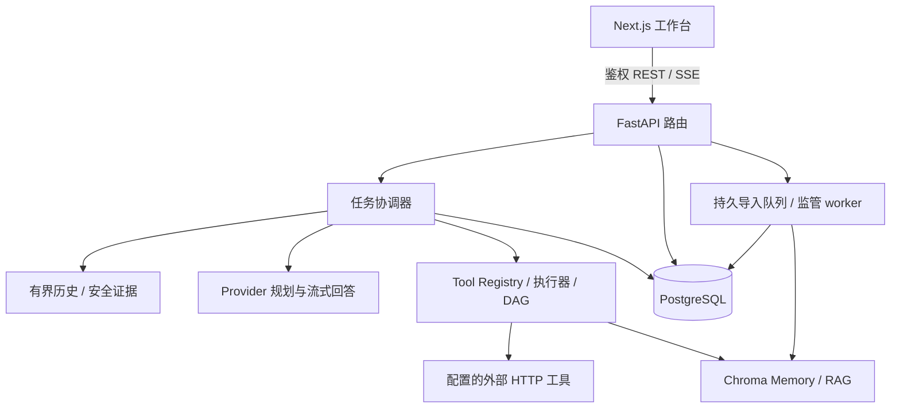

# 架构与设计边界

InsightAgent 围绕“执行可观察、依据可复核、历史可回放”组织应用，采用 Next.js 工作台、FastAPI 执行服务、PostgreSQL 业务账本与 Chroma 向量检索。当前是有明确预算的工具驱动 Agent，不提供通用操作系统代理或图编辑器。

## 系统分层

| 层 | 主要职责 | 入口 |
| --- | --- | --- |
| 路由 | 鉴权、请求校验、用户范围、响应与固定错误 | `backend/app/api/routes/` |
| 任务协调 | SSE、规划等待、队列槽位、取消/超时、终态与回答提交 | `chat_execution_service.py`、`task_queue_service.py` |
| 工具运行时 | 注册表/来源组合、输入归一化、执行策略、重试、脱敏与公开结果 | `tool_runtime.py` facade 及同主题模块 |
| 工具调度 | DAG 校验、结果绑定、拓扑波次、有界读取并发 | `tool_plan_dependencies.py`、`task_tool_execution.py`、`task_tool_parallel.py` |
| 证据与上下文 | 历史快照、RAG 正文/版本、HTTP 公开结果、执行清单 | `conversation_context.py`、`agent_*_context.py`、`answer_completion.py` |
| 持久化 | 会话/任务事务、Trace、用量、导出、治理 | `chat_persistence_service.py` facade 及主题模块 |
| 知识导入 | 幂等受理、数据库锁、分批确认、权限复核、中断恢复 | `rag_ingest_{jobs,worker,runner}.py` |
| 前端状态 | 服务端数据查询、SSE 合并、增量同步、历史回放 | TanStack Query、`chat-stream-store.ts` |

表中的服务文件位于 `backend/app/services/`，前端文件位于 `frontend/lib/stores/`；完整入口见两个模块 README。

## 一项任务如何执行

1. 创建用户范围内的任务与输入消息，任务等待流式执行槽位；创建接口本身不保证离开客户端后仍会自动执行。
2. 接管 stream，读取本任务创建前已完成的同用户/同会话问答快照，并冻结当前工具注册表。历史最多 6 轮、单消息 4,000 字符、JSON 16,000 字符。
3. Provider 返回结构化规划，运行时验证工具、输入与依赖。首轮调用失败保留规则回退；非法 DAG 拒绝整图，不能局部执行。规则回退不等于模型自主规划成功。
4. 就绪工具执行，公开结果与安全 Observation 驱动后续决策。默认最多 3 轮、32 工具节点；跨轮重复按实际输入检查。
5. 最终模型读取受预算约束的知识、HTTP 结果和实际执行清单，流式输出回答。执行证据是提示约束，不保证模型每句声明都正确。
6. 成功状态、Trace、用量和 assistant 消息在同一事务提交，再执行 best-effort Memory 摘要与 done。失败保留已有 Trace，重连回放不重新请求模型。

## 三类数据的分工

| 数据 | 存储 / 隔离 | 使用边界 |
| --- | --- | --- |
| 完整历史 | PostgreSQL，按用户/会话鉴权 | 消息、任务、Trace、用量、审计与回放；数据库是当前对话历史快照的来源。 |
| 会话语义记忆 | Chroma `memory_{session_id}` | 提供追加、查询与调试；任务后摘要 best-effort，当前没有自动长期召回链。 |
| 外部知识 | Chroma `kb_{user_hash}_{knowledge_base_id}` | 导入文档、来源与版本、知识检索；共享 `shared-*` 库限管理员写入。 |

Chroma 不可达时 Memory/RAG 请求返回 503；成功回答之后的 Memory 写入失败不反转任务。导入跨 PostgreSQL 与 Chroma 不具有分布式事务，失败可能已写入部分切块；状态确认数是本次写入下界，不是当前库大小。

## Embedding 的实际位置

应用使用 `chromadb.HttpClient`，未显式传入自定义 embedding function。当前安装版本的 Python 默认函数调用 ONNX MiniLM；在后端客户端进程计算文本向量，再交给 Chroma 存储/检索。API 与后台导入 worker 都需要默认模型缓存，不能把它理解为只在 Chroma 容器内运行。

试点后端镜像以非 root 用户在构建期下载、校验并预热 384 维模型，既有禁网运行验证有效；原生开发首次使用可能需要下载。库版本与 embedding 策略变更需复核既有 collection 的维度和检索质量。参考 [Chroma embedding 说明](https://docs.trychroma.com/docs/embeddings/embedding-functions)，项目实际配方见[部署预检](pilot-deployment-preflight.md)。

## 调度、恢复与一致性取舍

- 任务队列槽位在单后端进程内控制；不是分布式作业调度器。执行 owner / heartbeat / stale recovery 不能替代多实例部署实证。
- 默认工具串行。内建独立读取/计算及显式只读固定 HTTP GET 可配置为 1–4 并发，进程最多 8 个读取线程；写入工具继续串行。
- 底层 HTTP 不能被线程强制终止。取消阻止迟到结果写入与后续工具，但不能撤销外部副作用，供应商仍可能产生消耗。
- 完整分支重新规划且不复制历史结果；checkpoint 仅支持内建顺序计划，不支持 HTTP/DAG、自定义 runner 或写入回滚。
- Trace.seq 保证递增而非连续；前端按服务端 ID/seq 合并。流程图只显示明确记录的关系，不从记录顺序推断依赖。

## 运行时模块化决策

早期 tool-runtime-productionization 的长期结论是：把注册表、规划、单工具策略、结果投影与副作用编排按主题分开，保留旧导出 facade；停止没有调用收益的 wrapper 搬移。新增需求由实际问题驱动，优先复用最近的 typed seam，避免多次 hydration / dict 转换和同族包装层膨胀。

2026-05 的设计/交接流水账已退出当前文档树；原记录可从 Git 历史查看。本节保留有效决策，当前行为以[运行时契约](runtime-contracts.md)、代码和[验证基线](validation-baseline.md)为准。原始完整计划 `data/insightagent.plan.back.md` 始终只读，不因历史目标自动扩大当前实现。
