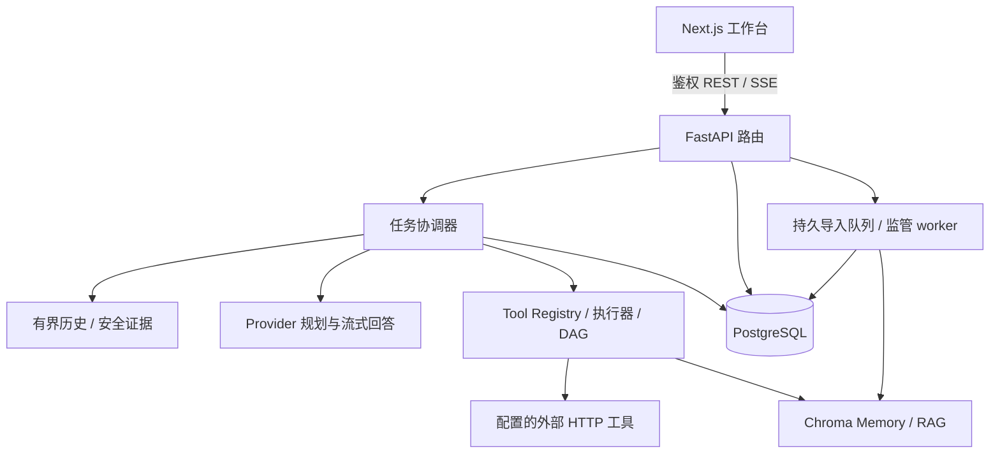

# 架构与设计边界

InsightAgent 围绕“执行可观察、依据可复核、历史可回放”组织应用，采用 Next.js 工作台、FastAPI 执行服务、PostgreSQL 业务账本与 Chroma 向量检索。当前是有明确预算的工具驱动 Agent，不提供通用操作系统代理或图编辑器。

## 系统分层

以下为完整应用。独立的 `showcase/` 经静态导出发布至 GitHub Pages，只读取公开案例 JSON 和图片；交互图与回放不连接此处的 API、模型或存储。展示结构与发布规则见[公开展示](showcase.md)。

| 层 | 主要职责 | 入口 |
| --- | --- | --- |
| 路由 | 鉴权、请求校验、用户范围、响应与固定错误 | `backend/app/api/routes/` |
| 任务协调 | SSE、规划等待、队列槽位、取消/超时、终态与回答提交 | `chat_execution_service.py`、`task_queue_service.py` |
| 工具运行时 | 注册表/来源组合、输入归一化、执行策略、重试、脱敏与公开结果 | `tool_runtime.py` facade 及同主题模块 |
| 工具调度 | DAG 校验、结果绑定、拓扑波次、有界读取并发 | `tool_plan_dependencies.py`、`task_tool_execution.py`、`task_tool_parallel.py` |
| 证据与上下文 | 历史快照、RAG 正文/版本、HTTP 公开结果、执行清单 | `conversation_context.py`、`agent_*_context.py`、`answer_completion.py` |
| 持久化 | 会话/任务事务、Trace、用量、导出、治理 | `chat_persistence_service.py` facade 及主题模块 |
| 知识导入 | 幂等受理、数据库锁、分批确认、权限复核、中断恢复 | `rag_ingest_{jobs,worker,runner}.py` |
| 前端状态 | 服务端数据查询、SSE 合并、增量同步、历史回放 | TanStack Query、`chat-stream-store.ts` |

表中的服务文件位于 `backend/app/services/`，前端文件位于 `frontend/lib/stores/`；完整入口见两个模块 README。

## 一项任务如何执行

1. 创建用户范围内的任务与输入消息，任务等待流式执行槽位；创建接口本身不保证离开客户端后仍会自动执行。
2. 接管 stream，读取本任务创建前已完成的同用户/同会话问答快照，并冻结当前工具注册表。历史最多 6 轮、单消息 4,000 字符、JSON 16,000 字符。
3. Provider 返回结构化规划，运行时验证工具、输入与依赖。首轮调用失败保留规则回退；非法 DAG 拒绝整图，不能局部执行。规则回退不等于模型自主规划成功。
4. 就绪工具执行，公开结果与安全 Observation 驱动后续决策。默认最多 3 轮、32 工具节点；跨轮重复按实际输入检查。
5. 最终模型读取受预算约束的知识、HTTP 结果和实际执行清单，流式输出回答。执行证据是提示约束，不保证模型每句声明都正确。
6. 成功状态、Trace、用量和 assistant 消息在同一事务提交，再执行 best-effort Memory 摘要与 done。失败保留已有 Trace，重连回放不重新请求模型。

## 三类数据的分工

| 数据 | 存储 / 隔离 | 使用边界 |
| --- | --- | --- |
| 完整历史 | PostgreSQL，按用户/会话鉴权 | 消息、任务、Trace、用量、审计与回放；数据库是当前对话历史快照的来源。 |
| 会话语义记忆 | Chroma `memory_{session_id}` | 提供追加、查询与调试；任务后摘要 best-effort，当前没有自动长期召回链。 |
| 外部知识 | Chroma `kb_{user_hash}_{knowledge_base_id}` | 导入文档、来源与版本、知识检索；共享 `shared-*` 库限管理员写入。 |

Chroma 不可达时 Memory/RAG 请求返回 503；成功回答之后的 Memory 写入失败不反转任务。导入跨 PostgreSQL 与 Chroma 不具有分布式事务，失败可能已写入部分切块；状态确认数是本次写入下界，不是当前库大小。

## Embedding 的实际位置

应用使用 `chromadb.HttpClient`，未显式传入自定义 embedding function。当前安装版本的 Python 默认函数调用 ONNX MiniLM；在后端客户端进程计算文本向量，再交给 Chroma 存储/检索。API 与后台导入 worker 都需要默认模型缓存，不能把它理解为只在 Chroma 容器内运行。

试点后端镜像以非 root 用户在构建期下载、校验并预热 384 维模型，既有禁网运行验证有效；原生开发首次使用可能需要下载。库版本与 embedding 策略变更需复核既有 collection 的维度和检索质量。参考 [Chroma embedding 说明](https://docs.trychroma.com/docs/embeddings/embedding-functions)，项目实际配方见[部署预检](pilot-deployment-preflight.md)。

## 调度、恢复与一致性取舍

- 任务队列槽位在单后端进程内控制；不是分布式作业调度器。执行 owner / heartbeat / stale recovery 不能替代多实例部署实证。
- 默认工具串行。内建独立读取/计算及显式只读固定 HTTP GET 可配置为 1–4 并发，进程最多 8 个读取线程；写入工具继续串行。
- 底层 HTTP 不能被线程强制终止。取消阻止迟到结果写入与后续工具，但不能撤销外部副作用，供应商仍可能产生消耗。
- 完整分支重新规划且不复制历史结果；checkpoint 仅支持内建顺序计划，不支持 HTTP/DAG、自定义 runner 或写入回滚。
- Trace.seq 保证递增而非连续；前端按服务端 ID/seq 合并。流程图只显示明确记录的关系，不从记录顺序推断依赖。

## 运行时模块化决策

注册表、规划、单工具策略、结果投影与副作用编排按主题分开，保留兼容 facade。维护优先复用已有类型与职责边界，避免重复转换和无调用收益的包装层。当前行为以[运行时契约](runtime-contracts.md)、代码和[验证基线](acceptance.md#验证基线)为准，设计历史从 Git 查询。

## Agent 上下文与反馈

### 会话上下文与知识证据

- 普通非 canonical mock 任务在执行开始时读取同用户、同会话中本任务创建前已完成的问答配对，按最近任务选取并恢复时间顺序。失败、取消、未配对、跨用户/会话内容，以及在本任务创建后才完成的答案均排除。
- 最多 6 轮，单消息最多 4,000 字符，历史 JSON 最多 16,000 字符；按完整配对裁剪，最新一对即使 JSON 转义膨胀也会缩短到预算内。SQL 读取同样限制条数和每条内容大小。
- 首轮规划、后续决策与最终回答共享同一快照。规则回退、实际工具执行、当前 task.prompt/message 与 Memory 追加仍使用本次原始输入，避免历史工具标记重放；完整分支重跑的新会话不复制父会话，checkpoint 分支与 canonical mock 演示保持原行为。
- 历史 assistant 上下文可选携带最终回答步骤的白名单 `completion` 原因，计入上述 JSON 预算；模型收到截断/执行限制及“结束不代表目标完成”的提示，损坏或缺失记录不推断。见[回答完整性](runtime-contracts.md#流结束与回答完整性)。
- 首轮 Trace.meta 可选追加 `conversation_context` 的 `turn_count`、`character_count` 与 `truncated`，不持久化整份模型历史提示词。
- 模型额外接收已脱敏 RAG Trace 的正文与知识库、来源、文档 ID、版本/hash，优先最近检索；最多 6 片段、单片段 1,200 字符、证据 JSON 8,000 字符，标记为不可信数据，并指导引用提供的来源/版本。计数型 Observation 和已有 Trace/导出保持原形状；证据提供不保证真实模型一定正确引用。
- 后续维护补齐公开 HTTP 工具结果：成功 action 的公开结果字段进入模型反馈与最终回答，补足计数摘要丢失的搜索条目等内容。只读取 `effective_result_output_keys` 并复用脱敏；最多 6 项、单项 JSON 3,000/总 JSON 8,000 字符，最多三层容器、每容器最多 6 项、单字符串最多 1,200 字符，并可进一步收缩以满足 JSON 预算；裁剪标记 `truncated`。失败结果、原始响应/输入/注册表配置不进入新增证据，原 Observation/Trace/export 与 canonical mock 保持原行为。
- 会话消息仍在 PostgreSQL，Chroma Memory 仍沿用已有追加/调试职责；这里没有新增长期语义回忆或附件服务。

### Agent 执行契约

执行方式为结构化工具规划 → 执行 → 安全 Observation → 下一轮工具规划 → 最终流式回答。复用现有 Provider、工具注册表、DAG 调度、取消/超时、SSE 和持久化。

- `AGENT_MAX_ROUNDS=3`，包含首轮，范围 1–8；设为 1 保持旧单轮行为。每任务最多 32 个业务工具节点，不计首轮 planner 工具。
- 只有首轮模型规划有效且包含业务工具时才启动反馈。canonical Mock、首轮规则回退、无业务工具和 checkpoint 分支保持单轮；不将 Mock 规则输出宣称为自主模型决策。
- 反馈使用任务启动时的工具注册表快照；各轮仍由现有执行器校验工具与用户资源权限。
- 后续规划只接受完整有效的工具列表；query/expression 必须明确给出非空文本，或由合法 input_bindings 提供，不从原请求或反馈提示补齐缺失参数。普通不完整决策整批拒绝为 invalid_decision；非法依赖图保留 tool_dependency_plan_invalid 与失败状态，不回退执行。首轮兼容默认值、检索可选 top_k/knowledge_base_id 及合法绑定保持可用。决策阶段 Provider 异常沿用任务失败处理。
- 首次/后续规划模型已返回但依赖图非法时，保持原图错误和失败状态，保存该次实际规划用量；调用以空正文错误终结时也保存其真实用量，首轮仍规则回退、后续仍失败；部分/缺失字段不估算，详见[用量口径](runtime-contracts.md#用量口径)。
- 各轮 DAG 独立；依赖与标量绑定仅引用本轮节点。跨轮通过安全 Observation 传递信息，不能引用上一轮 DAG 节点 ID。
- 跨轮防重复按工具名与实际输入比较；静态参数在决策时检查，绑定节点在结果替换后、启动工具/事件/并发工作线程前再检查。绑定占位值与节点 ID 不作为执行身份；相同模板得到不同参数可继续，同轮 DAG 重复节点和工具内部重试保持原行为。
- 任一就绪批次包含之前轮次的重复输入时，整批不启动；已执行的本轮上游结果保留，复用 `repeated_action` 停止 Trace/最终回答提示，停止时不额外调用决策模型，seq 及规划用量延续已有记录。
- 根据模型返回的工具列表动态追加行动；空列表结束工具阶段。轮次、总节点数、Observation 上限（24,000 字符）或重复规划动作触发终止；已有工具重试仍由执行器控制。
- 最终回答接收白名单工具停止原因与证据/未解决事项说明，并在最终 Trace 可选记录 agent_stop_reason；模型结束原因与聊天/详情提示见[回答完整性](runtime-contracts.md#流结束与回答完整性)，不宣称真实模型一定遵循提示。
- 终止 Trace 的 `agent_decision` 为 `no_tools`、`max_rounds`、`max_tool_calls`、`observation_limit`、`repeated_action` 或 `invalid_decision`；继续执行为 `continue`。到达限制表示结束工具阶段，不证明任务需求已全部满足。
- 每轮执行完毕、进入下一次模型决策前立即持久化已完成 Trace；取消/超时在决策前后复核，迟到决策不得追加工具。
- Trace.meta 可选追加 `agent_round`、`agent_decision`、`agent_from_step_ids`；SSE 事件名、Trace ID/seq、delta 和 JSON v1.0/Markdown 导出形状兼容。
- 成功任务的用量汇总包含首轮规划、后续决策（包括空列表/被拒绝响应）与最终回答；提供方缺失字段沿用估算规则。没有模型调用的限额终止步骤 token/cost 为 0。
- [任务/会话用量统计](runtime-contracts.md#用量口径)消费已持久化的 overall 总量，字段缺失时回退 final + planning；Dashboard、会话汇总与导出保持相同口径，来源筛选包含规划阶段，不改变任务明细。
- [正常任务成功保存](runtime-contracts.md#成功提交与终态竞争)将 completed/Trace/usage、assistant 消息与会话更新时间一起提交，避免成功状态可见但下一轮缺失回答；失败回滚与终态竞争沿用既有处理。
- 多轮任务不生成单轮 checkpoint 快照；`AGENT_MAX_ROUNDS=1` 和已有 checkpoint 分支仍保留原有资格。完整任务分支重跑不受影响。

实现入口：`conversation_context.py`、`agent_knowledge_context.py`、`agent_tool_context.py`、`agent_feedback.py`（均在 `backend/app/services/`）。静态与隔离验证命令见[开发手册](development-runbook.md#隔离专项入口)。
